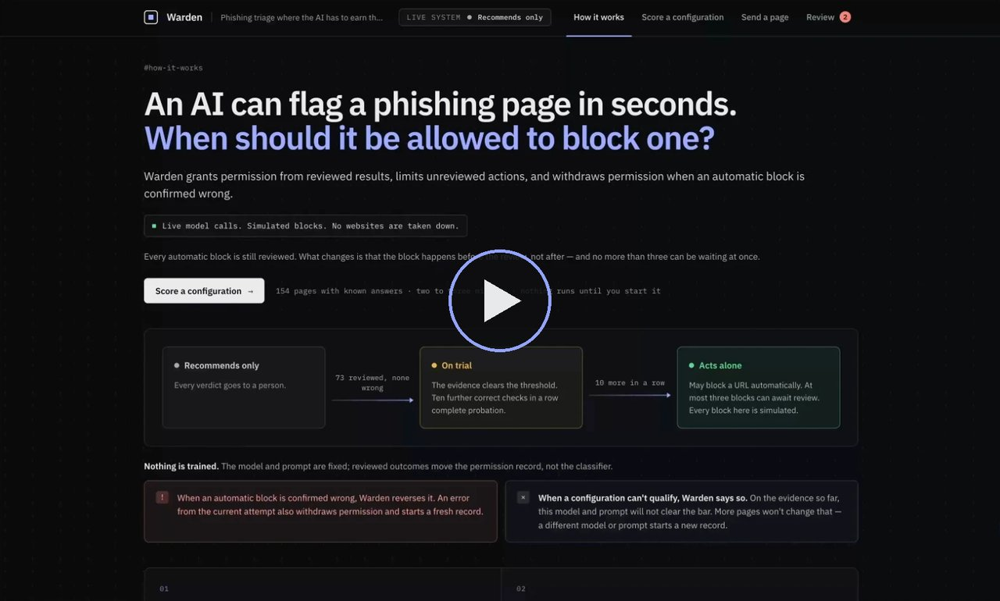

# Warden

Phishing triage where the AI has to earn the right to act.

An AI model can look at a reported page and say "phishing" in a couple of seconds. Recommending a takedown is easy. Letting the model carry one out on its own is the hard part, and most teams settle it on a hunch: either they trust the model and a wrong call takes down a legitimate site at machine speed, or they don't and a person sits on every decision.

Warden settles it with evidence. The classifier starts with no permission at all. Every verdict goes to a person, and every time a person confirms one, the record moves. Once the record proves the classifier is good enough, it may block URLs on its own, with at most three blocks waiting for review at any time. The moment one of its blocks is confirmed wrong, the block is undone, the permission is gone, and the record starts again from zero.

The permission belongs to one exact combination of model, prompt and policy. Change any of them and it's a different permission with an empty record, because what earned the trust isn't what's running any more.

It runs on Cloudflare Workers, with Workers AI doing the classifying and a SQLite-backed Durable Object holding each record.

[](https://vimeo.com/1231393392)

A short walkthrough of Warden, on Vimeo.

## What it does

1. **A URL is reported.** Warden fetches the page, treating the address as hostile input.
2. **It extracts signals.** 27 structural facts, checked by code rather than by the model: where the form posts, whether the brand on the page matches the host, whether it asks for a wallet's recovery phrase, and so on.
3. **The model gives a verdict.** Llama 3.3 70B on Workers AI answers phishing, not phishing or unsure, and has to cite signals that were actually found. A verdict pointing at nothing is rejected.
4. **A permission check decides what happens.** It's arithmetic the model can't reach. The verdict either blocks the URL now or goes to a reviewer, depending only on the record this exact configuration has earned.
5. **A reviewer confirms or corrects it.** That's the only thing that moves the record. A wrong automatic block is undone on the spot, and the permission goes with it.

Before any of that, you can **score a configuration**: run 154 pages with known answers through the live model and find out whether this model, prompt and policy are good enough to be worth deploying at all.

## Why this problem

Abuse teams are in a race. A phishing page does its damage in the hours it's up, and human review is the queue it waits in. A model can close that gap, but letting it act alone moves the risk somewhere worse: a false positive takes down a legitimate site, at machine speed, and attackers can manufacture false positives on purpose by planting accusations on a page they want removed. So the useful question isn't "how accurate is the model?" but "when may it act on its own, and how quickly does that stop when it's wrong?"

To decide what the test pages should cover, we took 300 URLs from the OpenPhish community feed and read the copies urlscan.io already held, contacting no live phishing site:

- **41 of the 300 were on `pages.dev` or `workers.dev`:** Cloudflare's own free hosting. Abuse of the platform you're defending is the normal case.
- **6 of the 17 readable pages sent their form by script with no form target,** which is why "form without action" is its own signal.
- **Nothing flagged a page asking for a wallet's recovery phrase,** the most valuable thing a wallet lure can steal. Warden has a signal for it now.

The example pages are written from those techniques. None is a copy of a real page.

## How it works, in one picture

```text
Recommends only ── 73 reviewed, none wrong ──▶ On trial ── 10 more in a row ──▶ Acts alone
      ▲                                                                              │
      └───────────── an automatic block is confirmed wrong: undone, back to zero ────┘
```

- **Recommends only.** Every verdict goes to a person.
- **On trial.** The evidence clears the bar, but the classifier still can't act. Ten further correct checks in a row complete probation.
- **Acts alone.** It may block a URL automatically. At most three blocks can await review; hit that and everything queues for a person again.

The bar is a Wilson lower bound over confirmed phishing verdicts: the worst the classifier's true precision could plausibly be, given what's been seen so far. It has to reach 95%. Three right out of three is 100% and proves nothing; with no mistakes it takes 73 to clear the bar, with one mistake it takes 110. There's also the other end: if the best the precision could plausibly be falls below 95%, Warden says the configuration can't qualify, rather than letting it grind away in "recommends only" forever.

Nothing is trained. The model and prompt never change. Reviewed outcomes move the permission record, not the classifier.

## Running it

You need Node 22 or later and a Cloudflare account. The free plan is enough.

```sh
git clone https://github.com/simonmorley/warden.git
cd warden
npm install
cp apps/worker/.dev.vars.example apps/worker/.dev.vars
npx wrangler login
npm run dev
```

Then open http://localhost:8787.

That's the whole setup. A few notes on what those steps are doing:

- **`.dev.vars`** holds `WARDEN_OPEN=true`, which tells the Worker it's running on your own machine and doesn't need its own access token. Only `wrangler dev` reads this file. No deploy ever does, so a deployed copy can't end up open by accident.
- **`wrangler login`** is needed even locally, because Workers AI has no local emulation. Every verdict is a real model call on your account. If you'd rather use an API token, see the next section.
- **`npm run dev:host`** does the same but listens on every interface, so you can reach it from another machine. Bear in mind that with `WARDEN_OPEN=true` anyone who can reach it can use it, and spend your inference.

The dashboard has four screens:

1. **How it works.** The idea on one page.
2. **Score a configuration.** Start here. It runs 154 pages with known answers through the live model, in two to three minutes. The page shows three things, in order:
   - **The answer:** proven precision against the 95% bar, and whether the configuration clears it, not yet, or can't.
   - **What it got wrong.**
   - **A rehearsal:** the same pages replayed through the permission rules on a throwaway ledger, so you can watch permission being earned, used, and lost to a page that tricks the model.

   Each run has its own link (`#score/<run id>`), and the page reopens the latest run in any browser.
3. **Send a page.** Give it a URL, or pick one of the example pages, and see every step: what was extracted, what the model said, whether its evidence held up, and what it was allowed to do.
4. **Review.** Confirm whether each verdict was right. This is the only thing that moves the live record.

Local state lives in `apps/worker/.wrangler/`. The live record is permanent by design and there's no reset button, so if you want a clean slate locally, stop the server and delete that folder.

### What it costs

Each classification costs about 27 neurons on Workers AI. A full scoring run is 154 calls, roughly 4,200 neurons, which is about five cents at paid rates. Workers AI gives every account 10,000 neurons a day for free, so on the free plan you get about two full runs a day, plus whatever you send by hand. The scoring screen shows the running cost as it goes.

## Credentials

There are two different credentials in play, and it's worth keeping them apart.

**Your Cloudflare credential** lets Wrangler run and deploy the Worker on your account. For local use, `npx wrangler login` is simplest: it opens a browser and stores an OAuth token. If you'd rather use an API token, put it in a `.env` file at the repository root:

```sh
CLOUDFLARE_API_TOKEN=...
# Only if the token can see more than one account:
CLOUDFLARE_ACCOUNT_ID=...
```

The scripts load that file into Wrangler's process with Node's `--env-file-if-exists`. The Worker itself never sees it. (Wrangler's own `--env-file` flag would hand it to the Worker as a binding, and the Worker has no business holding an account credential.)

To make the token, go to **My Profile → API Tokens → Create Token → Create Custom Token** and give it three permissions:

| Permission | Why |
| --- | --- |
| Account · Workers AI · Edit | Call the model |
| Account · Workers Scripts · Edit | Run and deploy the Worker |
| Account · Account Settings · Read | Let Wrangler read the account |

Limit it to the one account you're using. AI Gateway isn't required, so it needs no permission here.

**Warden's own token** (`WARDEN_TOKEN`) is the bearer token a deployed copy requires for anything that changes state or spends inference. Locally you don't need it, because `WARDEN_OPEN=true` covers that. For a deployment, see below.

## Deploying

Nothing is deployed by default, and that's deliberate. A public copy would spend the owner's inference on whoever found it, and running it against your own account with `npm run dev` is the better way to try something you've just cloned.

If you do want one:

```sh
openssl rand -hex 32                                  # make a token
npm run wrangler -w @warden/worker -- secret put WARDEN_TOKEN
npm run deploy
```

A deployment has no `.dev.vars`, so it always requires the token. If the token isn't set either, it fails closed rather than open. The dashboard deliberately never holds a credential, so on a deployment it can read but not act; you drive it with the token instead:

```sh
curl -X POST https://<your-worker>/classify \
  -H "authorization: Bearer $WARDEN_TOKEN" \
  -H "content-type: application/json" \
  -d '{"url":"https://example.com/login"}'
```

A shared bearer token is fine for a proof of concept and wrong for anything real: it can't say which person applied a label, and you can't revoke one person. The right answer for a real deployment is Cloudflare Access in front of the endpoints that apply labels.

To route model calls through your own AI Gateway, add `AI_GATEWAY_ID` to the Worker's vars. Leave it out and calls go straight to Workers AI. A gateway belongs to one account, so mine would be no use to you, which is why it's optional.

## Cloudflare services

| Service | What it does here |
| --- | --- |
| **Workers** | The whole application: HTTP API, fetching, inference, and serving the dashboard. One Worker. |
| **Workers AI** | The classifier, `@cf/meta/llama-3.3-70b-instruct-fp8-fast`, called with JSON mode at temperature 0. |
| **Durable Objects (SQLite)** | `Ledger`: one object per record. The live record is one, and every scoring run gets its own. Each holds its permission, decisions, labels, blocks and history in its own database, with versioned migrations. `RunIndex`: a short ordered list of scoring runs, so the latest can be found from any browser. |
| **Static Assets** | The dashboard, served through the `ASSETS` binding with the Worker seeing every request first, so routing and security headers are identical in tests, locally and in production. |
| **AI Gateway** | Optional. Logs and rate-limits model calls when `AI_GATEWAY_ID` is set. |
| **Workers Observability** | Logs and traces, on in the config. |

Three that aren't used, and why. **Browser Rendering** is the obvious next step: Warden fetches the HTML as served, so a page assembled by script looks empty to it, and a kit that shows something harmless to datacentre addresses fools it. **Access** is the production answer to the shared token above. **D1 and KV** would be a second source of truth next to the Durable Objects, which is exactly what the Durable Objects are there to prevent.

## The API

| Method | Path | Token | What it does |
| --- | --- | --- | --- |
| `POST` | `/classify` | yes | Classify a page. Send `{ "url" }` and Warden fetches it, or `{ "url", "html" }` to supply the source |
| `GET` | `/live` | — | The live record: permission, decisions, history, and every judgement in order |
| `POST` | `/live/labels` | yes | Confirm a verdict: `{ "decisionId", "label": "right" \| "wrong" }` |
| `POST` | `/demo/runs` | yes | Start scoring a configuration. Returns a run id |
| `GET` | `/demo/runs/latest` | — | The id of the scoring run started most recently |
| `GET` | `/demo/runs/:id` | — | A scoring run: its result, its rehearsal ledger and its progress |
| `GET` | `/corpus` | — | What the example pages are |
| `GET` | `/corpus/pages/:id` | — | One example page, with what it really is |
| `GET` | `/corpus/pages/:id/source` | — | One example page, served as plain text so Warden can fetch it like any other URL |

The API still calls scoring runs "demo runs". That's the older name, and renaming a working endpoint for a change of framing wasn't worth it.

Anything that changes state or spends inference needs the token on a deployment. Malformed input gets a 4xx with a message saying what was wrong, never a 500.

## How the code is laid out

```text
packages/engine     the permission rules: pure functions, no I/O
packages/signals    what gets extracted from a page: pure functions
packages/fixtures   the 154 example pages, the plan a scoring run walks, and a safety check
apps/worker         the Worker: HTTP, the ledger Durable Object, fetching, inference
apps/dashboard      the dashboard: static HTML, CSS and JavaScript
docs/               the PRD, the technical design, and the decision log
```

The split that matters most is between the engine and everything else. The engine decides whether a verdict becomes a block, and it has no network, no storage, no clock and no randomness. Its TypeScript config doesn't even include the types for them, so I/O there fails to compile. That's what makes the interesting behaviour testable without mocks, and it's what keeps the rule honest: nothing the model returns, including its own stated confidence, can reach the decision to act.

```sh
npm test            # every workspace, in the Workers runtime
npm run typecheck
npm run check       # both
```

The tests use a fake model and never call Workers AI, so they need no credentials. The product itself only ever uses the real one.

## Design choices

The PRD and technical design in `docs/` have the full reasoning, and `docs/decision-log.md` records every change since they were written, with what raised it. The short version:

- **The gate is arithmetic, not a model.** A learned gate would need its own gate. A threshold someone can read, set in advance and recompute is something you can defend in an incident review. The dashboard recomputes the bound in your browser from the ledger's own counts, so you don't have to take its word for it.
- **Only phishing verdicts count.** Being right that a page is harmless is easy, and counting it would flatter the record. Correct "not phishing" calls are tracked but move nothing.
- **A verdict must cite evidence that exists.** A phishing verdict has to point at signals Warden actually extracted from the page, or it's rejected and earns nothing. "Why was this blocked?" always has an answer, and a verdict pointing at nothing can't act.
- **What a mistake costs depends on whether it was acted on.** A wrong call that went to a person costs record. A wrong automatic block is always undone, and if it was authorised in the current attempt, the permission goes with it. Undoing the block and withdrawing the permission are logged as separate events.
- **The damage is capped.** At most three automatic blocks can be unreviewed at once. The slot is taken in the same transaction that creates the block, so two requests can't both take the last one.
- **One Durable Object per record.** Each call reads, decides and writes with nothing in between, so a revocation can't be raced. All SQL lives in a storage layer as named, parameterised statements, and the schema is append-only migrations.
- **Scoring qualifies the configuration; the live record qualifies the deployment.** A labelled set isn't the traffic a permission would act on, so a good score grants nothing. It tells you whether a configuration is worth putting in front of real reports, where it starts from zero anyway.
- **The example pages are written, not captured.** Each one is the smallest page that shows a technique seen in live phishing kits, on reserved domains, with fictional brands. The alternative was capturing live pages and sanitising them, and sanitising only removes what you thought of. A test fails the build if a page breaks the rules.
- **The model was picked on false positives.** Seven candidates ran the real prompt and validator; the three finalists ran every trap and hard negative three times. Llama 3.3 70B made half the false positives of the next best, and every one of them came from a planted instruction, never from misreading a legitimate page.
- **No credential in the browser.** An earlier version had a token field in the dashboard. A shared secret typed into a web page is the weakest part of anything, so it went.
- **Fetching a reported URL is treated as hostile input.** HTTPS only, no credentials in the URL, nothing aimed at private or internal addresses, re-checked at every redirect, at most three hops, and the body read up to a cap.

## What running it showed

**The chosen configuration sits right on the bar.** Across four full runs it made two or three false positives in 141 to 143 phishing verdicts, and never missed a phishing page. Every false positive was a trap. Its proven precision came out between 93.9% and 95.01%. One run cleared the bar and three didn't. At this set's size, a single mistake decides the verdict, which is the honest answer: 154 pages can say it's close, and can't say it's proven.

Two findings go beyond the project.

**Prompt injection only worked in one direction.** Every page that told the model "I'm legitimate" was still called phishing, 14 out of 14. The attacks that worked were the other way round: a legitimate page carrying a third party's claim that it was malicious, like a forum post, a review or an issue tracker. The exploitable direction produces false positives, which is exactly the harm Warden is built to bound, and it's the direction most injection defences aren't looking at.

**Imitating process beats imitating instruction.** The framing every model fell for was an issue tracker with a status field and a `confirmed-malicious` label. The one they resisted best was a forum post simply saying so. An injection that looks like a decision already taken by someone with authority is harder to resist than one that sounds like an order.

`packages/fixtures/README.md` has the numbers.

## Limitations

- **The example pages demonstrate the mechanism. They don't measure accuracy on real traffic.** They have a technique's structure but not its craft. A score on them says whether the classifier reads structure, not how it would do on a live queue.
- **Pages aren't independent.** One phishing kit across many domains is closer to one piece of evidence than many, and the bound counts pages. A real deployment would count kits, not pages.
- **Checking the bar after every result makes a lucky pass likelier than 95% suggests.** A sequential test would fix that, and would still be arithmetic.
- **A plain fetch sees the HTML as served.** No scripts run, and cloaking works. That's Browser Rendering's job, and it isn't built.
- **Blocks are simulated.** A blocklist entry and a log line. Nothing leaves the system.
- **There's no command-line client yet.** On a deployment, that means `curl` and the token.

## How this was built

I built Warden with Claude Code, working from a PRD and technical design I'd worked through beforehand in a separate Claude conversation. The dashboard's look came from a design made in Claude's design tool and implemented from there.

The way I directed it is written down in `CLAUDE.md`, which is the set of rules the build ran under:

- **Test first**, with the failing test and the passing code committed separately, so the history shows red before green.
- **The model is always real.** Every verdict in the product is a live Workers AI call. Fakes are allowed inside unit tests and nowhere else.
- **The engine has no I/O**, enforced by its compiler config.
- **A verdict never authorises itself.**
- **Every design change is logged**, in the same commit as the doc edit it causes.
- **The repository is public**, so there are no secrets, account IDs or personal paths, and the example pages use reserved domains only.

Most of the code-quality rules came from reading what it wrote: guard clauses instead of nested `if`s, SQL only in the storage layer, a short doc comment on every function. Each went into `CLAUDE.md` as soon as I'd asked for it once, so I didn't have to ask twice.

**Where it was good.** It found a contradiction in the PRD before any code existed: one section said a mistake's cost depended on the current state and another said it depended on whether the verdict had been acted on. It proposed the evidence rule while writing the inference adapter's tests. It measured the models rather than guessing, and it noticed from a live run that the cap of three never actually bound in the demo, because every block was being reviewed the instant it was made. The fix, making review lag behind for part of the run, is in the decision log.

**Where I had to correct it.** Plenty of places, and they're the more useful part of the record:

- The first demo ran on a fake model. I wanted every verdict to be real, and it is now.
- The technical design listed specific tests to write. Test-first matters; a test inventory in a design doc doesn't, so it came out.
- Three of the seven candidate models scored zero on valid answers. They were fine: our adapter wasn't unwrapping the response shape they return. One fix took them to six out of six.
- It tested one injection framing, watched a model resist it, and reported that the model "saw through" injection. Against five framings the same model fell for four. That's why the set has seven now.
- The dashboard had a token field. It shouldn't have, and it doesn't.
- The first version of the demo ran for two minutes with nothing happening on screen, above a row of tiles that had nothing to report.
- The original plan for the example pages was to capture live phishing and sanitise it. Claude Code's own safety guardrails stopped that step, and on reflection the guardrail was right: writing pages from techniques is the better design, for the reasons above.
- Scoring was framed as a "demo", which invited the reading that the model was being trained until it was trusted. It isn't, and the screen now says what it actually is: an evaluation of one configuration, which grants nothing.
- It rendered a bound of 94.98% as "95.0%" next to a 95.0% bar and a "not yet" verdict. Correct underneath, misleading on screen, and fixed.
- The scoring screen led with the raw hit rate, 97.9%, in large type beside a "not yet" verdict, which read as a contradiction. It now leads with the lower bound the verdict is actually judged on.
- The screens were written in the builder's vocabulary: "campaign", "epoch", rejection codes. Recording a walkthrough made that obvious in a minute. They now say what they mean.

Most of those are in `docs/decision-log.md`, dated, with what raised them.

## Further reading

- `docs/prd.md` explains what Warden is for, the permission lifecycle, and why the gate is arithmetic.
- `docs/technical-design.md` covers the components, their boundaries, and the build order.
- `docs/decision-log.md` records every change since the design, newest first.
- `packages/fixtures/README.md` covers how the example pages were written, the safety rules, and what the traps found.
- `CLAUDE.md` holds the rules the build ran under.

## Licence

MIT, in `LICENSE`. The IBM Plex fonts the dashboard ships are under the SIL Open Font License, alongside them in `apps/dashboard/public/fonts/`.
