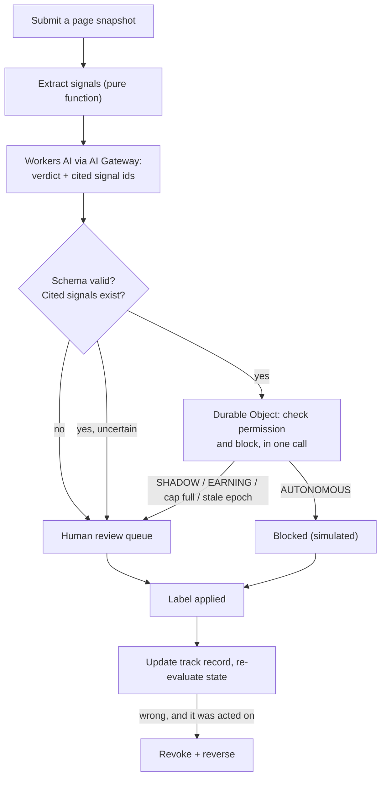

# Warden — PRD

*Phishing triage where the AI has to earn the right to act.*

*Design document, September 2026. Built as a proof of concept on Cloudflare Workers. For what is actually implemented, how to run it and how it was built, see the README.*

---

## 1. What Warden is

Warden is a phishing triage tool with a permission system in front of it.

An AI classifier looks at a reported page and says whether it's phishing; normally a human then decides whether to block it. Warden lets the AI skip the human, but only once it has built a track record, only for one narrow action, and only until it gets something wrong.

Three things happen in order:

1. **It classifies.** A page comes in, the AI returns a verdict with its reasoning and the evidence it used.
2. **It checks whether it's allowed to act.** Separate logic the AI can't influence decides whether the verdict becomes a block or goes to a human.
3. **It records why.** Every decision, permission grant, action and reversal is written down.

## 2. The problem it solves

Teams putting LLMs into abuse workflows hit the same wall. Recommending a takedown is easy and takes a second; granting the authority to carry one out is the hard part, and nothing in the usual toolkit settles it. A benchmark score is a claim about someone else's data, a vendor's accuracy figure is an assertion rather than evidence, and neither says how this model behaves on this queue, this week.

So permission is either handed over on a hunch or withheld entirely. Hand it over and one wrong call takes down a legitimate site at machine speed, with no record of what the grant rested on and no clean way to withdraw it. Withhold it and a human sits on every decision, and nothing is automated.

Warden is a third answer: authority is demonstrated, not asserted. The AI earns a narrow permission from evidence gathered where it will act, and loses it when it fails.

## 3. What it changes

Not the amount of review: every automatic block still gets checked, because the cap in section 7.3 means unreviewed blocks stop the AI acting again. Warden neither replaces analysts nor reduces their workload.

What changes is **when** the human is in the loop. Today review comes before the block, so the page stays up until someone gets to it. With Warden, on the cases the AI has earned, the block happens immediately and review follows — with a hard limit on how far ahead of review the AI can get.

That buys three things:

- **Phishing comes down in seconds, not hours.** The human is the backstop, not the bottleneck.
- **"Why was this blocked?" always has an answer.** Every action points at the track record that authorised it and the policy version in force.
- **Model changes don't inherit trust.** Swap the model or edit the prompt and the track record starts again from zero, because what earned the trust isn't what's running any more.

## 4. Core concepts

**Verdict.** What the AI says about a page: `phishing`, `not_phishing` or `uncertain`, with references to the evidence it used. A recommendation, never permission. `uncertain` goes to a human and never counts towards the track record. Confidence is recorded but gates nothing.

**Action.** The one thing Warden can do: block a single exact URL. Simulated in this POC — a blocklist entry and a log line, nothing leaves the system. Blocking a URL doesn't block its domain.

**Permission.** The right to turn a verdict into an action without a human. Not a global switch — it belongs to one combination of:

- the abuse type (phishing)
- the exact action allowed (block this one URL)
- the model version
- the prompt version
- the policy version — the rules in this document

Change any one and it's a different permission with its own track record, starting from nothing. A new prompt doesn't inherit the old one's credibility.

**Trusted label.** Confirmation that a verdict was right or wrong. The only thing that moves the track record. The AI can't label its own work; neither can the page it was looking at, nor whoever reported it.

In the live ledger, labels come from a human analyst and nothing else. In a demo ledger, they come from each fixture's hand-set ground truth, standing in for the analyst. Ground-truth labels are accepted only in demo ledgers, so a demo run can never write to the live one.

**Ledger.** The store holding one permission's state, track record, actions and history. Each demo run gets its own, keyed by run id, so runs start clean and concurrent viewers can't disturb each other. The live ledger is separate and permanent.

**Page identity.** The normalised URL: lowercase scheme and host, default port and fragment removed. Deduplication and reversal both key on it. The content hash is stored alongside as evidence.

**Track record.** Of the verdicts where the AI said "phishing" and a human checked, how many were right. Permission is earned from this.

**Epoch.** A numbered attempt at earning permission. Lose permission and a new epoch starts with the counters at zero. Old epochs stay in the audit trail; they just stop counting.

**Evidence.** The page snapshot, the signals extracted from it, the raw model response and the policy in force. Stored for every decision so any action can be explained later.

## 5. The permission lifecycle

Three states:

| State | What it means |
| --- | --- |
| **SHADOW** | The AI recommends; everything goes to a human. Nothing is blocked automatically. The track record builds. |
| **EARNING** | The track record has passed the bar. Still no automatic blocking — probation, to catch a good run that was luck. |
| **AUTONOMOUS** | The AI may block a URL on its own, within the limits in section 7. |

```text
SHADOW ──── track record passes the bar ────▶ EARNING
EARNING ──── 10 further checks, bar still holding ────▶ AUTONOMOUS
EARNING ──── track record drops below the bar ────▶ SHADOW  (same epoch, keep counting)
EARNING ──── a mistake, bar still holding ────▶ probation restarts at 0
AUTONOMOUS ─── track record drops below the bar ────▶ SHADOW  (same epoch, nothing reversed)
any state ──── an automatic block from this epoch is wrong ────▶ SHADOW  (new epoch, counters reset, block reversed)
any state ──── an automatic block from an older epoch is wrong ────▶ no change  (block reversed)
```

A check is a counted verdict labelled correct. Probation is a run of them, so any mistake during EARNING restarts the count at zero even when the bar still holds.

AUTONOMOUS can lose the bar without anything being blocked. Labels arrive late, and verdicts that queued for a human — because the cap was full, or because they were made before promotion — can land afterwards and drag the bound down. That returns the scope to SHADOW in the same epoch, with nothing reversed, because nothing was acted on.

The last two transitions are keyed on the action, not the state. A block can be confirmed wrong long after the scope has already dropped to SHADOW on the bound, and it still has to be undone. See 7.2.

Two consequences:

- **Promotion isn't retrospective.** Recommendations already with a human stay there. Reaching AUTONOMOUS doesn't go back and act on them.
- **A mistake that was acted on isn't the same as one that wasn't.** See section 7.

## 6. How permission is earned

### 6.1 Which verdicts count

Only verdicts where **the AI said "phishing"** count, and only if:

- the response was well-formed (valid JSON matching the schema)
- every signal id it cited exists in the extracted signals
- a human has since labelled it right or wrong

Everything else is excluded, and the exclusions are fixed in advance, not settled once the outcome is known:

- **Correct "not phishing" verdicts don't count.** They're easy and would inflate the record. Track them separately so missed phishing stays visible.
- **`uncertain` doesn't count.** It goes to a human and earns nothing either way.
- **Unlabelled verdicts don't count.** No confirmation, no credit.
- **Malformed responses, timeouts and provider errors don't count.** They go to a human and earn nothing.
- **Duplicates don't count.** The same page submitted twice is one data point.

### 6.2 The bar, and why it isn't just "95% correct"

The obvious rule — "let it act once it's 95% right" — is broken, because three out of three is 100% and means nothing.

So Warden uses the **pessimistic** score instead: given the evidence so far, what's the worst the true accuracy could plausibly be? It starts terrible and climbs as evidence accumulates, since a small sample rules little out. This is the **Wilson lower bound**, a standard way to floor a proportion when all you have is a sample. Formula in the appendix; five lines of code.

The bar therefore demands **both** a high hit rate and enough evidence.

| Track record | Pessimistic score | Result |
| --- | --- | --- |
| 3 right out of 3 | 43.8% | Nowhere near |
| 30 out of 30 | 88.6% | Not yet |
| **73 out of 73** | **95.0%** | **Clears the bar — enters EARNING** |
| 109 out of 110 (one mistake) | 95.0% | Clears it, but it took 110 |
| 140 out of 142 (two mistakes) | 95.0% | Clears it, but it took 142 |

A flawless run needs 73 confirmed-correct calls. One mistake and it needs 110, two and it needs 142. That's the whole mechanism: below AUTONOMOUS, mistakes reset nothing — they just make the AI work harder to prove itself.

**EARNING** then needs 10 further checks with the bar still holding. A mistake during probation restarts the count at zero; if it also drags the score under the bar, the scope drops to SHADOW and keeps counting in the same epoch.

**Defaults** (all configurable):

| Setting | Value |
| --- | --- |
| Required score | 0.95 |
| Confidence | z = 1.96 |
| Probation length | 10 |
| Max unreviewed automatic actions at once | 3 |

`z = 1.96` is the two-sided 95% value, so the lower endpoint is a **97.5% one-sided bound** — deliberately conservative. Compare with `≥`, not `>`: at 73/73 the bound clears 0.95 by about 0.00001.

**Honest limitations.** Three, and they compound:

- **Repeated checking.** Testing the bar after every result and promoting the first time it passes inflates the chance of passing by luck. Production would use a method built for continuous checking — a sequential probability ratio test, or an anytime-valid confidence sequence.
- **Independence.** Wilson assumes independent samples. One phishing kit deployed across many URLs is one piece of evidence, not many, so counting pages overstates what has been proven. Production would count clusters or campaigns rather than pages.
- **Population.** A templated fixture set demonstrates the mechanism. It does not measure the classifier's accuracy on real traffic, and nothing here should be read as if it did.

## 7. How permission is lost

### 7.1 Mistakes are judged by what they cost

- **A mistake on a verdict that wasn't acted on** — made in SHADOW or EARNING, or queued for a human — costs track-record credit and nothing else. Nothing was blocked, so there's nothing to take away and nothing to reverse. The score drops and promotion gets further away.
- **A mistake on an automatic block** — the AI blocked something on its own and a human confirms it was legitimate — reverses that block and, if the block was authorised in the current epoch, revokes permission and starts a new epoch at zero. What matters is whether the verdict was acted on, not the state the scope happens to be in when the label lands; see 7.2.

### 7.2 Revoking and reversing are two different things

- **Revoking** stops future actions: back to SHADOW, and the epoch increments.
- **Reversing** undoes an action that already happened. Only the block caused by the confirmed mistake is removed.

They are logged and displayed as separate events. Other unreviewed automatic blocks stay in place and stay listed.

**Requests carry the epoch the caller saw.** If that isn't the current epoch by the time the ledger handles it, the request can't produce an automatic block and goes to a human. A revocation therefore can't be raced by a decision made a moment earlier.

**A wrong automatic block is always reversed**, whatever state the scope is in when the label lands. Whether the epoch also increments depends on which epoch authorised it:

- **Authorised in the current epoch** — the epoch increments and the scope returns to SHADOW, even if it had already dropped there on the bound. Permission earned since that block was authorised was earned on a record that included a mistake nobody had confirmed yet.
- **Authorised in an earlier epoch** — the block is reversed and recorded, and nothing else changes. Permission for that epoch is already gone.

### 7.3 The damage is capped

Warden only knows a verdict was wrong when someone confirms it. That takes time, and the AI can act again meanwhile.

So **at most 3 automatic blocks may be unreviewed at once**: hit the cap and everything queues for a human until one is reviewed. The slot is reserved in the same transaction that creates the block, so two concurrent requests can't both take the last one. Unreviewed blocks count against the cap whatever epoch authorised them; a revocation doesn't clear the backlog it created.

**Labels are immutable.** A repeated identical label is a no-op. A conflicting one is rejected rather than overwriting what's there.

This bounds how much can go wrong before anyone notices. It doesn't bound real-world harm, or make detection faster.

## 8. Why the gate is arithmetic, not a model

Someone will ask why the gating policy isn't learned. Three reasons.

**Nothing is being learned, by design.** Feedback goes into the permission ledger, never back into the LLM. The classifier's verdict on a page is identical on day one and day ninety: no gradient, no weight update, no exploration. An operator can swap it for a different one, but section 4 treats that as a new permission with an empty track record. Feedback updating an access-control decision around a fixed classifier is not reinforcement learning.

**A learned gate would need its own gate.** Put a second model in charge of trusting the first and you have to establish when to trust the second. The chain ends at a rule a person can read, set in advance and defend in an incident review.

**An explanation can't be verified.** The classifier does produce one, and Warden asks for it — reasoning and cited evidence both. But nothing in that text can be checked against what actually drove the output, and a page that fools the verdict will fool the explanation alongside it. It reads no differently when the verdict is wrong.

So Warden checks what can be checked and measures what can be measured. Every signal the verdict cites must exist in what was actually extracted from the page, or the verdict is rejected. Beyond that the verdict stays untrustworthy, and the decision to act on it is arithmetic anyone can recompute:

> Blocked because permission was granted at 83 confirmed-correct out of 83, lower bound 95.6%, under policy 4f2a…, epoch 2.

Someone who doesn't trust you can check that. Nobody can check "the model thought the login form looked suspicious".

The nearest analogues aren't ML either. A canary deploy promotes on a measured error rate and rolls back on its own. A credit limit rises with payment history. A driving licence is closest: passing the test doesn't make anyone a better driver, it makes them permitted to drive, and one serious offence takes it away however many clean miles came first.

There is a fair criticism of the gate, and it isn't that it should be learned. It's the one in section 6.2: checking the threshold after every result makes a lucky pass more likely than 95% suggests. A sequential test would fix that, and would still be arithmetic.

## 9. What gets built

**In:**

1. Phishing triage over a curated set of stored page snapshots.
2. Real Workers AI inference, returning a structured verdict.
3. The permission ledger: three states, versioned scope, epochs.
4. Human labelling that updates the track record.
5. One action: simulated block of an exact URL.
6. Revocation and reversal on a confirmed mistake.
7. A demo run that drives the whole lifecycle through live inference, on a fresh ledger each time.
8. One dashboard page.

**Out, and why:**

- **Real takedowns and external enforcement.** The permission mechanism is what's being tested, and a takedown integration exercises none of it. It would also make the actions irreversible, and reversal is half the argument.
- **Live URL fetching and browser rendering.** Stored snapshots keep the inputs identical between runs, so any difference in outcome comes from the model rather than the pages, and they keep live phishing out of the build.
- **Other abuse types.** Not a config entry. Each needs its own track record and its own evidence that the AI is any good at it.
- **Drift detection, calibration, campaign clustering.** Each is a second way to revoke permission, and each needs its own evidence before it earns that power.

## 10. How it's built



| Piece | Why |
| --- | --- |
| **Workers** | The API, signal extraction, dashboard |
| **Workers AI** | The classifier. Temperature 0, structured output, validated server-side |
| **Durable Object** | Permission state, track record, blocklist and history. Authorising and blocking happen in one call, next to the data, one request at a time |
| **AI Gateway** | Every model call goes through it, for raw-response logging and rate limiting |
| **R2** *(optional)* | Page snapshots, if they outgrow bundled fixtures |

**Not used:** KV (eventually consistent, so unsafe for showing a block was removed), D1, Queues, Vectorize, Browser Rendering. Each is reasonable later; none is needed here.

## 11. What gets stored

All of it in the Durable Object.

| Record | Fields |
| --- | --- |
| **Permission** | ledger id, scope (type, action, model id, prompt hash, policy hash), epoch, state, right/wrong counts, current score, probation progress, unreviewed action count |
| **Decision** | id, page identity, content hash, epoch it was made in, verdict, confidence, whether it counted, cited signal ids, raw model response, version hashes in force, what the permission check returned, timestamp |
| **Label** | id, decision id, who labelled it, right or wrong, timestamp |
| **Action** | id, decision id, exact URL, epoch it was authorised under, active or reversed |
| **Event** | id, what changed (promotion, revocation, reversal), why, the numbers at the time, timestamp |

## 12. Security

The page is written by the attacker. Treat everything from it as hostile.

- Send the model extracted signals and a bounded excerpt, marked as untrusted data. Never paste the raw page in as if it were instructions.
- Require a strict response schema. Reject anything that doesn't match.
- Check that every signal id the model cites exists in the extracted signals.
- Render page content in the dashboard as escaped text. Never execute it.
- Require the token on every endpoint that changes state or spends inference — starting a demo run and classifying a page both cost real model calls.
- Compare the token in constant time.
- Serve the dashboard under a strict Content-Security-Policy.

**What this does and doesn't achieve.** A well-formed response can still carry a verdict an attacker talked the model into. Warden doesn't prevent that; it bounds the damage. A misled classifier can block one URL, only if it has earned the right, and only 3 times before everything queues for a human — and the moment a human confirms the error, the block is reversed and the permission is gone.

**Considered, not built.** Two Zero Trust pieces fit the design and are out of scope here:

- **Access** in front of the endpoints that apply labels. "Trusted" currently means holding a shared token, so a label can't be attributed to a person and a single analyst can't be revoked. Access would make it an authenticated identity, putting a name on every label in the audit trail and a service token on machine submissions.
- **Tunnel**, for the production shape rather than this one. A Worker has no origin to tunnel to. A real deployment puts the enforcement adapter and the analyst console inside the operator's own network, where Tunnel reaches them with no public ingress and no inbound ports open.

## 13. The demo

One button. Every verdict is a live Workers AI call against the fixture set — nothing is recorded or replayed. Labels stand in for an analyst, taken from each page's hand-set ground truth, and the screen says so. Each run gets a fresh ledger, so runs don't interfere and there is nothing to reset.

Inference runs concurrently ahead of the ledger while submissions stay in fixture order, which keeps a run to a few minutes.

**The expected beats.** These are what the fixture set is curated to produce, not what is guaranteed. The model decides each verdict at the moment it runs, and where it deviates the dashboard shows what actually happened.

1. **Around 30 correct calls.** The score sits near 88.6%. Still SHADOW. The naive rule — 95% observed, at least 30 samples — would promote here; Wilson says the true rate could be as low as 88.6%.
2. **A hard negative the model gets wrong.** The score drops, the target moves out beyond 73, and promotion recedes. Nothing is revoked or reversed, because nothing was blocked.
3. **The bar clears, then probation.** SHADOW → EARNING → AUTONOMOUS, once the bound holds through 10 further checks.
4. **A page is blocked automatically.** The first action with no human involved.
5. **A trap page.** A legitimate page carrying a weaponised report — user-generated content on the page telling reviewers it is phishing. The model is fooled and blocks it.
6. **Ground truth arrives: it was legitimate.** The gap between acting and finding out is visible.
7. **Permission revoked, block reversed**, as two separate events. The same kind of mistake as beat 2, a different consequence, because this one was acted on.
8. **The next report goes to a human.** A decision made under the old epoch is refused an automatic block.

The set carries more than one trap, so a model that resists the first still meets another. If it resists them all, the run ends without a revocation and the dashboard says so plainly.

**Try it live.** Separately, pick a fixture or paste a snapshot and classify it on the spot. The screen shows the verdict, the evidence it cited, whether validation passed and what the permission check returned. The page joins the live ledger's human queue.

## 14. The dashboard

One page:

- Current state, scope and versions, epoch, score, counted sample, distance to the bar.
- Unreviewed automatic actions, out of 3.
- A feed of decisions: verdict, cited evidence, validation result, label, what the permission check said, what happened.
- Promotions, revocations and reversals, with reasons.
- Buttons: run demo, try it live.

## 15. Scope discipline

Priority order, most important first: the permission lifecycle, reversal of a wrong action, the inference path, then the dashboard.

Everything marked optional in section 10 can go without weakening the argument, and the dashboard can be plain. What can't be cut is the boundary: a verdict must never authorise its own action, and a confirmed mistake must always be able to undo one.

## Appendix — the Wilson lower bound

```
p = right / n
lower = (p + z²/2n − z·√(p(1−p)/n + z²/4n²)) / (1 + z²/n)
```

With `z = 1.96`: the two-sided 95% value, so this is a 97.5% one-sided bound (see 6.2). Return "insufficient evidence" at n = 0.

When every call is correct this simplifies to `n / (n + z²)`, so a perfect run is purely a question of volume, and 73 is simply where that curve crosses 0.95.
